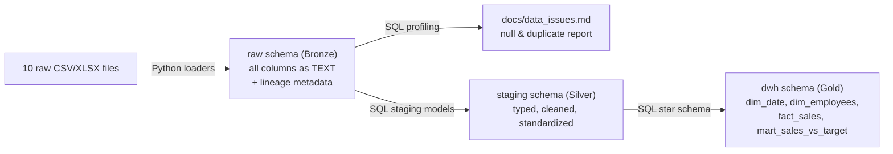

# 📊 VietDist Analytics Project

_Building a Bronze → Silver → Gold data warehouse to consolidate 10 raw operational sources from VietDist - a Vietnamese FMCG distribution company - into a governed PostgreSQL warehouse for tracking sales performance against monthly targets._

**+ Business question:** How can raw, disconnected sales, distributor, and HR data be consolidated into a reliable warehouse that tracks actual sales performance (revenue, quantity, new customers) against monthly targets - by employee, region, and time period?

**+ Domain:** A consumer goods (FMCG) distribution company in Vietnam operating two sales channels - direct retail sales to customers and wholesale orders through third-party distributors - across multiple regions and provinces.

Author: Hung Nguyen
Tools Used: Python & SQL

---

## 📑 Table of Contents
1. [📌 Background & Overview](#-background--overview)
2. [📂 Dataset Description & Data Structure](#-dataset-description--data-structure)
3. [⚒️ Main Process](#️-main-process)
4. [🔎 Final Conclusion & Recommendations](#-final-conclusion--recommendations)

---

## 📌 Background & Overview

### Objective:
### 📖 What is this project about? What Business Question will it solve?

This project builds an end-to-end data pipeline for VietDist. Ten heterogeneous raw source files - covering sales transactions, distributor orders, customers, products, distributors, employees, sales targets, territory mapping, returns, and promotions - are ingested, profiled, cleaned, and modeled into a star-schema warehouse so sales leadership can reliably answer: *"Are our sales reps hitting their monthly targets?"*

✔️ Ingest 10 raw CSV/Excel sources into a `raw` (Bronze) layer in PostgreSQL, with full lineage metadata (source file, batch ID, ingestion timestamp) and a success/failure audit log\
✔️ Profile every source table for null rates and duplicates before any transformation, and document findings and cleaning decisions\
✔️ Clean, type-cast, and standardize the data into a `staging` (Silver) layer\
✔️ Model a `dwh` (Gold) star schema - including **SCD Type 2** history for employees and **versioned** sales targets - to support point-in-time analysis\
✔️ Build a sales-vs-target performance mart that compares actual monthly revenue, quantity, and new-customer counts against quota, by employee

### 👤 Who is this project for?

✔️ Data/analytics engineers studying Bronze → Silver → Gold pipeline design\
✔️ BAs/DAs learning practical SQL data modeling (SCD Type 2, versioned facts, star schema)\
✔️ Sales operations & management teams needing to track rep and regional performance against quota

---

## 📂 Dataset Description & Data Structure

### 📌 Data Source
- Source: 10 internal operational extracts simulating VietDist's sales, HR, and distributor systems, stored in `VietDist_Database/VietDist_DataSouces/`
- Size: 10 tables, ranging from 40 rows (`promotion_program`) to 119,101 rows (`sales_transactions`) - ~165,000 records in total
- Format: 5 `.csv` files + 5 `.xlsx` files (two workbooks - employees and sales targets - contain multiple versioned sheets)

### 📊 Data Structure & Relationships

#### 1️⃣ Tables Used

All 10 source tables are loaded into `raw`, transformed into 10 corresponding `staging` models, and consolidated into 4 tables in the `dwh` (Gold) schema.

| # | Source File | Raw Table | Rows | Format |
|---|---|---|---:|---|
| 1 | SRC01_sales_transactions.csv | `sales_transactions` | 119,101 | CSV |
| 2 | SRC02_sales_target_plan.xlsx | `sales_target_versions` | 1,950 | XLSX (multi-sheet, versioned) |
| 3 | SRC03_customer_master.csv | `customer_master` | 2,000 | CSV |
| 4 | SRC04_product_master.xlsx | `product_master` | 100 | XLSX |
| 5 | SRC05_distributor_orders.xlsx | `distributor_orders` | 35,945 | XLSX |
| 6 | SRC06_distributor_master.csv | `distributor_master` | 138 | CSV |
| 7 | SRC07_employee_master.xlsx | `employee_master` | 228 | XLSX (multi-sheet, versioned) |
| 8 | SRC08_territory_mapping.xlsx | `territory_mapping` | 1,843 | XLSX |
| 9 | SRC09_return_transactions.csv | `return_transactions` | 3,665 | CSV |
| 10 | SRC10_promotion_program.xlsx | `promotion_program` | 40 | XLSX |

#### 2️⃣ Table Schema & Data Snapshot

Table 1: `sales_transactions` (core fact source - retail/direct channel)

| Column Name | Description |
|---|---|
| order_id | Order identifier |
| order_date / order_month / order_quarter / order_year | Order date parts |
| customer_id | FK to customer_master |
| region / province / channel | Geography & sales channel |
| employee_id | FK to employee_master (rep who closed the sale) |
| product_id / product_category | FK to product_master |
| quantity / unit_price / discount_pct / discount_amount | Line-item pricing |
| gross_amount / net_amount | Revenue before/after discount |
| delivery_status / payment_method / payment_status | Fulfillment & payment |

Table 2: `sales_target_versions` (versioned monthly quota by employee)

| Column Name | Description |
|---|---|
| employee_id / employee_name / region / team | Rep & org assignment |
| year / month | Target period |
| plan_version / effective_from / effective_to | Version control for target revisions |
| target_revenue / target_quantity / target_new_customers | Quota metrics |

Table 3: `employee_master` (SCD Type 2 source - role/region history)

| Column Name | Description |
|---|---|
| employee_id / full_name / gender / date_of_birth / join_date | Employee profile |
| position / region / team | Role & assignment (changes over time) |
| status / version / effective_date | Row versioning |
| resign_date / transfer_note | Populated only for resigned/transferred staff |

*The remaining 7 sources (`product_master`, `distributor_master`, `distributor_orders`, `territory_mapping`, `return_transactions`, `promotion_program`) follow the same pattern - full column definitions are in the `staging_model_query'/` SQL files.*

### Entity Relationships

---

## ⚒️ Main Process

**Architecture: Bronze → Silver → Gold**

### Task 1: Data Ingestion (Bronze Layer) - Python

Ten loader scripts in `01_ingestion/loaders/` each read one source file through a shared `file_parser.py` utility, which auto-detects CSV encoding (tries `utf-8`, `utf-8-sig`, `cp1258` to handle Vietnamese text) and dispatches to `pandas.read_csv`/`read_excel` accordingly. Every column is cast to `TEXT` before loading (`convert_all_to_text`) so raw ingestion never fails on type mismatches - type casting happens later, deliberately, in the Silver layer.

Each load is tagged with `_source_file`, `_source_platform`, `_batch_id`, and `_ingested_at` for lineage, then written to PostgreSQL via SQLAlchemy. Every run - success or failure - writes a row to a `raw.ingest_log` audit table (rows loaded, duration, error message if any). Two sources ship as multi-sheet workbooks with version history: `load_employees.py` skips the `Change_Log` tab, and `load_sales_targets.py` only processes sheets prefixed `Plan*`, tagging each with a `version_label`.

### Task 2: Data Profiling & Quality Checks - SQL

Before any cleaning, each of the 10 raw tables is profiled (`02_sql_analytics/profiling_query/`) for null rates per column and full-row duplicates. Results are documented in [`docs/data_issues.md`](docs/data_issues.md).

**Summary of findings:**

| Table | Rows | Duplicates | Notable Nulls |
|---|---:|---:|---|
| sales_transactions | 119,101 | 0 | none in key columns |
| sales_target_versions | 1,950 | 0 | none |
| customer_master | 2,000 | 0 | `tax_code` 51.75% null |
| product_master | 100 | 0 | none |
| distributor_orders | 35,945 | 0 | none in key columns |
| distributor_master | 138 | 0 | none |
| employee_master | 228 | 0 | `resign_date` 96.49%, `transfer_note` 97.81% null |
| territory_mapping | 1,843 | 0 | none |
| return_transactions | 3,665 | 0 | none |
| promotion_program | 40 | 0 | none |

**Key decisions from the profiling:**
✔️ `customer_master.tax_code` nulls are expected - a customer only has a tax code if they requested a tax invoice - so the field is kept as-is rather than imputed.\
✔️ `employee_master.resign_date` / `transfer_note` nulls are expected for active, non-transferred employees and don't affect analysis.\
✔️ `promotion_program.applicable_products` packs multiple product IDs into one cell, delimited by `|` - flagged for splitting/exploding into one row per product during staging.\
✔️ All 10 sources came back with **zero duplicate rows**, so no deduplication logic was needed anywhere in the pipeline.

### Task 3: Staging Layer - Cleaning & Standardization (SQL)

Ten staging models in `02_sql_analytics/staging_model_query'/` cast raw `TEXT` columns to proper types (`DATE`, `INTEGER`, `FLOAT`), standardize Vietnamese phone numbers by prefixing the local leading `0`, and generate surrogate keys for tables that lack a natural one (e.g., `stg_sales_transactions` builds `sales_transaction_key` from `order_id + product_id` since one order can contain multiple line items).

Two models handle the more complex profiling findings directly:
- **`stg_promotion_program`** - `UNNEST(STRING_TO_ARRAY(applicable_products, '|'))` explodes the pipe-delimited product list into one row per applicable product, exactly as flagged in the profiling step.
- **`stg_sales_targets_versioned`** - uses `ROW_NUMBER() OVER (PARTITION BY employee_id, year, month ORDER BY effective_from DESC)` to collapse multiple target-plan revisions down to the single most current target per employee per month.

### Task 4: Star Schema Modeling - Gold Layer (SQL)

`02_sql_analytics/star_schema_table/` builds the final analytical layer in the `dwh` schema:

- **`dim_date`** - calendar dimension spanning 2022–2026 (day/month/quarter/calendar year), plus a `fiscal_year` that rolls over each September.
- **`dim_employees`** - a true **SCD Type 2** dimension. A `LEAD()` window function over each employee's ordered versions derives `effective_to` and `is_current`, so the warehouse preserves full history of role, region, and team changes rather than overwriting them.
- **`fact_sales`** - grain of one row per order line item, carrying quantity, pricing, discounts, and net revenue from `stg_sales_transactions`.
- **`mart_sales_vs_target`** - the project's core output. Joins actual monthly performance (revenue, quantity, order count, and new-customer count - detected by comparing each order date to a customer's first-ever order date) from `fact_sales` against `stg_sales_targets_versioned`, then computes `percent_revenue_achieve` and `percent_quantity_achieve` per employee per month.

`mart_sales_vs_target` output columns:

| Column | Description |
|---|---|
| employee_id / employee_name / region / team | Rep identity & assignment |
| year / month / plan_version | Target period & version |
| target_revenue / target_quantity / target_new_customers | Quota |
| actual_revenue / actual_quantity / total_orders / actual_new_customers | Actuals |
| percent_revenue_achieve / percent_quantity_achieve | Actual ÷ target, as % |

---

## 🔎 Final Conclusion & Recommendations

📍 Key Takeaways:

✔️ Ten disparate operational sources were consolidated into one governed warehouse using a raw → staging → dwh (Bronze/Silver/Gold) pattern, with every load traceable through `raw.ingest_log`.\
✔️ Profiling before transformation kept cleaning decisions evidence-based: the only meaningful null rates (`tax_code`, `resign_date`, `transfer_note`) are explainable business conditions, not data defects, and zero duplicates meant no dedup logic was needed anywhere.\
✔️ SCD Type 2 modeling (`dim_employees`) and target versioning (`stg_sales_targets_versioned`) let the warehouse answer "what was true as of a point in time" - important for a sales org where territories, teams, and quotas change mid-year.\
✔️ `dwh.mart_sales_vs_target` is warehouse-ready to power a BI dashboard for sales leadership to track rep and regional attainment against quota.

📍 Recommended Next Steps:

✔️ Externalize the hardcoded local `DATA_FOLDER` path and DB credentials in the loader scripts (already using `.env` via `python-dotenv` for credentials - extend the same approach to file paths) so ingestion runs on any machine, not just the original developer's.\
✔️ Add row-count reconciliation checks between `raw` and `staging` (and `staging` → `dwh`) to catch silent data loss during transformation.\
✔️ Extend `mart_sales_vs_target` to incorporate `distributor_orders` and `return_transactions`, giving a fuller revenue-net-of-returns view across both the direct and distributor channels - currently the mart only reflects the direct sales channel.\
✔️ Build a BI dashboard (Power BI/Tableau/Looker) on top of `dwh.mart_sales_vs_target` as the next deliverable for stakeholders.
